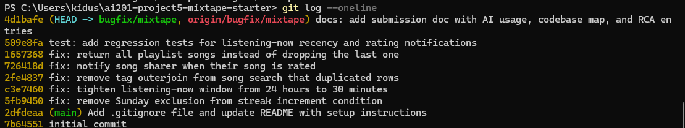

# Project 5: Mixtape Bug Hunt — Submission

## AI Usage

I used Claude heavily on this project, and for more than the "explain this function" role the brief describes — it did much of the hands-on investigation while I directed the work, so I want to be specific about the split.

**What Claude did:** After I forked the repo, Claude cloned it into its own sandbox, read every file (models, all five services, routes, tests, seed data), and identified candidate root causes for all five issues from reading the code. It then reproduced each bug before fixing anything — running the existing test suite (which caught #1 and #5), and writing small scripts against a seeded database that exercised the real HTTP routes to reproduce #2, #3, and #4. It wrote the fixes, the commit messages, the regression tests, and the first draft of this document.

**What I did:** Set the strategy and constraints (fix order, one-commit-per-fix discipline, targeted minimal changes), reviewed each diagnosis and fix before it was committed, and ran the commits/push on my fork. I also made the call on ambiguous judgment points — most notably what the "correct" recency window for Issue #2 should be, where we used the seed data's comments as the spec.

**Where AI-first reading paid off vs. where verification mattered:** The most interesting case was Issue #3. Reading the code, Claude predicted the tag outerjoin would duplicate multi-tag songs — but when it ran the test suite, the "duplicates" test *passed*. Instead of accepting either the prediction or the passing test at face value, it ran the query three ways: the raw SQL row count was 3, the legacy `Query.all()` returned 1, and the 2.0-style `select()` returned 3. That's how we learned the bug was real at the SQL level but masked by legacy-API entity deduplication in this environment. A pure "ask AI what's wrong" approach would have flagged the join; a pure "trust the tests" approach would have concluded there was no bug. Cross-checking both against actual execution was what produced the correct diagnosis.

The brief also warns that the README can mislead: the README's example call chain casually mentions that rating a song is handled by `notification_service.rate_song()`, which turned out to be the architectural clue for Issue #4 — the rating logic lives in the notification service, yet never creates a notification. Claude flagged that oddity during orientation, before opening any service file, and it held up.

## Codebase Map

*(Written during orientation, before any bug work.)*

**Entry point and wiring.** `app.py` is a Flask application factory (`create_app`) that configures a SQLite database via Flask-SQLAlchemy and registers four blueprints under URL prefixes: `/songs`, `/playlists`, `/users`, `/feed`. The `if __name__ == "__main__"` block exists but the README warns against `python app.py` (double-import issue); the app is meant to be run with `FLASK_APP=app:create_app flask run`.

**Data model (`models.py`).** Six models — `User`, `Tag`, `Song`, `ListeningEvent`, `Rating`, `Notification`, `Playlist` — plus three plain association tables: `friendships` (symmetric user↔user, seeded bidirectionally), `song_tags` (song↔tag), and `playlist_entries` (playlist↔song, with extra columns: `position`, `added_by`, `added_at` — so playlist order is an explicit stored position, not insertion order). `Rating` has a unique constraint on `(user_id, song_id)`, which is why `rate_song` updates in place on re-rate. `User.listening_streak` and `User.last_listened_at` live directly on the user row — there's no separate streak table; streak state is just those two columns.

**Layering pattern.** Every route parses input, delegates immediately to a service function, and formats the response (JSON + status code). All business logic lives in `services/`. One architectural oddity: song *rating* logic lives in `notification_service.py` (`rate_song`), not in a song or rating service — presumably because rating is supposed to be a notification-generating interaction, like `add_to_playlist` which lives in the same file.

**Services:**
- `streak_service.py` — records `ListeningEvent`s and updates the user's streak based on calendar-day gaps between `now` and `last_listened_at`.
- `feed_service.py` — two feeds: `get_friends_listening_now` (recency-filtered by a module-level `RECENT_THRESHOLD`, deduped to most-recent event per friend) and `get_activity_feed` (last N events, deliberately *not* recency-filtered).
- `search_service.py` — title/artist `ilike` search returning `Song.to_dict()`, which includes tags via the `Song.tags` relationship (`lazy="subquery"`).
- `notification_service.py` — generic `create_notification`, plus the two interaction handlers (`add_to_playlist`, `rate_song`) and notification retrieval/mark-read.
- `playlist_service.py` — playlist creation and retrieval; `get_playlist_songs` joins through `playlist_entries` and orders by `position`.

**Data flow traced — a user rates a song:** `POST /songs/<song_id>/rate` → `routes/songs.py::rate()` parses `user_id` and `score`, calls `notification_service.rate_song(user_id, song_id, score)` → validates score range, loads Song and User, checks for an existing `Rating` for that `(user, song)` pair (updates it if found, else inserts), commits, and returns the Rating, which the route serializes with `to_dict()`. For comparison, the playlist-add flow (`POST /playlists/<id>/songs` → `notification_service.add_to_playlist`) does the same load-validate-mutate-commit dance but ends with a `create_notification(...)` call to the song's sharer.

**Data flow traced — listening updates a streak:** `POST /songs/<song_id>/listen` → `streak_service.record_listening_event` creates a `ListeningEvent` with `listened_at=now`, then calls `update_listening_streak(user, now)`, which compares `now.date()` against `last_listened_at.date()`: same day → no-op; 1 day gap → increment; otherwise → reset to 1. These same `ListeningEvent` rows are what both feed functions query.

**Tests and seed data.** `tests/` covers streaks, search, and playlists (feed and notifications had no coverage — see regression tests). `seed_data.py` creates 5 users with friendships, 13 songs with 0/1/3 tags, 3 playlists, listening events at controlled ages, and one example `song_added_to_playlist` notification. The seed file's comments turned out to be a spec in disguise: it explicitly says events "within the past 30 minutes — should appear in 'listening now'" and older ones "should NOT appear in 'listening now' after fix."

---

## Root Cause Analysis Entries

### Issue #1 — My listening streak keeps resetting

**How I reproduced it:** The existing test suite already encodes the expectation: `tests/test_streaks.py::test_streak_increments_on_sunday` calls `update_listening_streak` with a Saturday datetime then a Sunday datetime and asserts the streak reaches 2. Running `pytest tests/test_streaks.py` on the starter code fails that test with `assert 1 == 2` — the Sunday listen resets the streak instead of incrementing it. Any Saturday→Sunday consecutive listen triggers it; no other day pair does.

**How I found the root cause:** The issue names `streak_service.py`, which has only one function that mutates the streak: `update_listening_streak`. It's ~25 lines, so I read the whole branch structure. The increment branch is `elif days_since_last == 1 and today.weekday() != 6:` — a weekday condition bolted onto what should be a pure "consecutive day" check. Python's `weekday()` returns 6 for Sunday, so the condition reads "increment on a consecutive day, *unless that day is Sunday*." The failing test's dates (June 15–16, 2024 = Sat/Sun) matched that exactly, which is the moment I was sure this was the cause and not just a suspicious area.

**The root cause:** In `update_listening_streak`, the consecutive-day branch required `today.weekday() != 6` in addition to `days_since_last == 1`. `datetime.weekday()` numbers Monday=0 through Sunday=6, so on any Sunday the condition is false, control falls to the `else` branch, and `listening_streak` is set to 1. The streak therefore reset every single week at the Saturday→Sunday boundary for every active user — which is exactly the "keeps resetting" experience in the report. There is no legitimate reason for a weekday condition here at all: consecutive-day detection is fully captured by the date difference.

**My fix and side-effect check:** Removed `and today.weekday() != 6`, leaving `elif days_since_last == 1:`. This is the smallest change that makes the branch mean what the docstring says ("If the user listened yesterday: streak increments by 1"). Side-effect check: all five streak tests pass — new-user initialization, same-day no-op, consecutive-day increment, skipped-day reset, and the Sunday case. Both sides of the boundary behave correctly: Sat→Sun increments, and Sat→Mon (skipped Sunday) still resets via the `days_since_last == 2` path.

### Issue #2 — Friends Listening Now shows people from yesterday

**How I reproduced it:** Seeded the database and hit the real route with Flask's test client. Kenji's only friend activity is a listening event from nova ~2 hours old (plus older ones); `GET /feed/<kenji_id>/listening-now` on the starter code returned that 2-hour-old event as "listening now." More generally, any friend event up to 24 hours old appeared. (Nova's feed was a misleading reproduction target: her three friends all also have <30-minute events, and the per-friend dedup shows only each friend's most recent event — so her feed looks identical before and after the fix. Kenji's feed is where the bug is visible: 1 stale entry before, 0 after.)

**How I found the root cause:** `feed_service.py::get_friends_listening_now` filters events with `ListeningEvent.listened_at >= cutoff` where `cutoff = now - RECENT_THRESHOLD`, and `RECENT_THRESHOLD = timedelta(hours=24)` at module top. The comparison logic is correct; the constant is the bug — a 24-hour window is "friends who listened today or yesterday," not "friends listening now." Confidence that this was the intended bug (and not just my opinion about UX) came from two places: the sibling function `get_activity_feed` is explicitly documented as the *unfiltered* feed, implying listening-now is supposed to be tightly time-boxed; and `seed_data.py`'s comments state outright that events within the past 30 minutes "should appear in 'listening now'" while events from 2+ hours ago "should NOT appear in 'listening now' after fix."

**The root cause:** `RECENT_THRESHOLD` was set to `timedelta(hours=24)`. Every friend listening event from the past full day passed the recency filter, so the feed surfaced sessions from the previous evening as current activity. The dedup step then made this worse in a subtle way: because only each friend's most recent event is shown, a friend who listened once at 11 pm yesterday occupied a "listening now" slot for a full 24 hours.

**My fix and side-effect check:** Changed the constant to `timedelta(minutes=30)`, matching the seed data's stated expectations. One-line change; the query and dedup logic are untouched. Side-effect checks: (1) `get_activity_feed` doesn't use `RECENT_THRESHOLD` at all, so the intentionally-unfiltered feed is unaffected; (2) verified both boundary sides against the seeded DB — nova's feed still shows her three friends with 10/15/20-minute-old events, while kenji's feed correctly drops to 0 entries; (3) added regression tests (`tests/test_feed_and_notifications.py`) covering a 5-hour-old event (excluded) and a 5-minute-old event (included).

### Issue #3 — The same song keeps showing up twice in search

**How I reproduced it:** This was the most interesting reproduction, because the naive attempt *failed*. The starter's own test `test_search_no_duplicates_multi_tag_song` (whose comment says the bug should make a 3-tag song appear 3 times) passes on the starter code, and hitting `GET /songs/search?q=Crown Heights` against the seeded DB returned the 3-tag song once. But the bug is real at the SQL level: running the exact query from `search_songs` and checking `query.count()` returns **3** rows for that one song. The duplicates exist in the result set; they were being hidden downstream (see below). To confirm, I ran the same statement through SQLAlchemy's 2.0-style `select()` API — `session.execute(stmt).scalars().all()` returns 3 Song rows. So the condition that triggers visible duplicates is: a song with ≥2 tags, retrieved through any execution path that doesn't deduplicate entities.

**How I found the root cause:** Reading `search_service.py::search_songs`, the query outer-joins `Song` to the `song_tags` association table — but then the filter only references `Song.title` and `Song.artist`, and the tags in the response come from `Song.to_dict()`, which reads the `Song.tags` relationship (loaded separately via `lazy="subquery"`). The join contributes literally nothing except row multiplication: SQL returns one row per (song, tag) pair, so a 3-tag song is 3 rows and an untagged song is 1 row (outer join). The reason the route currently returns 1 is an accident of API choice: the legacy `Query.all()` path applies automatic entity deduplication, while the modern `select()` path (and any future refactor toward it, pagination with LIMIT/OFFSET, or counting with `.count()`) exposes the duplicates. The `.count()` == 3 vs `.all()` == 1 discrepancy was the moment the full picture clicked.

**The root cause:** `search_songs` performs an unnecessary `outerjoin(song_tags, ...)` that is used by neither the filter nor the output. The join multiplies each matching song by its tag count in the SQL result set. In the current environment the legacy Query API masks this by deduplicating mapped entities, but the query itself is wrong: `count` is inflated (3 for one matching song), and any non-deduplicating execution path — including the documented-as-preferred 2.0 `select()` style — returns duplicate songs, which matches the user report. The duplication being *conditional* (only multi-tag songs, only some execution/pagination paths) is exactly why users saw it "inconsistently."

**My fix and side-effect check:** Removed the `outerjoin` (and the now-unused `song_tags` import), leaving a plain filtered query on `Song`. Tags still appear in results because they were never coming from the join — `Song.tags` loads them via its own subquery. Side-effect checks: all five search tests pass (match, no-match, and no-duplicate cases for 0/1/3-tag songs); post-fix the raw `count()` for the Crown Heights query is 1, so the SQL is now correct regardless of which execution API is used; and tag data verified present in the route response after the fix.

### Issue #4 — I got notified when a friend added my song to a playlist but not when they rated it

**How I reproduced it:** Against the seeded DB via the real routes: checked nova's notification count (`GET /users/<nova_id>/notifications` → 1, the seeded playlist-add notification), then had darius rate nova's shared song "Midnight Drive" via `POST /songs/<song_id>/rate` with score 5. Nova's notification count afterward: still 1. The rating itself saves correctly (the endpoint returns the Rating), but no notification is ever produced — exactly the report.

**How I found the root cause:** The README's own example call chain was the first clue: rating is handled by `notification_service.rate_song()` — rating logic living in the *notification* service strongly implies it was designed to be a notification-generating interaction. Following the hint to compare the working notification line-by-line against the missing one: `add_to_playlist` (same file) ends with an `if song.shared_by != added_by_user_id:` guard followed by `create_notification(...)`. `rate_song` performs the identical load/validate/save/commit sequence — and then just `return rating`. Nothing is conditionally skipped, no wrong recipient, no typo in a type string: the notification step simply does not exist. Diffing the two functions' structure was the moment of certainty.

**The root cause:** Architectural omission rather than a broken line. The codebase's pattern is that interaction handlers in `notification_service.py` both persist the interaction and notify the affected sharer; `add_to_playlist` implements both halves, while `rate_song` implements only persistence. There was no code path anywhere in the app that creates a `song_rated` notification — the `Notification.notification_type` docstring even mentions `'song_rated'` as an expected type, confirming it was planned and never wired up.

**My fix and side-effect check:** Added the missing half to `rate_song`, mirroring the working pattern exactly: after the commit, `if song.shared_by != user_id:` then `create_notification(user_id=song.shared_by, notification_type="song_rated", body=f"{rater.username} rated your song '{song.title}' {score}/5.")`. The guard prevents self-notification when users rate their own shared songs, matching `add_to_playlist`'s guard. Side-effect checks: rating still saves and the endpoint still returns 201 with the Rating (existing behavior untouched — the notification is appended after the rating commit, so a rating can never be lost to a notification failure); verified via route that darius rating nova's song now raises her count 1→2 with the correct body; verified nova rating her own song leaves her count unchanged; re-rating updates the existing Rating row as before (unique constraint path unaffected). Regression tests for both the notify and self-rate cases are in `tests/test_feed_and_notifications.py`.

### Issue #5 — The last song in a playlist never shows up

**How I reproduced it:** `tests/test_playlists.py` seeds a 5-song playlist and asserts `get_playlist_songs` returns 5; on the starter code it returns 4 (`test_playlist_returns_all_songs` fails, and `test_playlist_returns_songs_in_order` fails because "Track 5" is missing). Also confirmed against the seeded app: `GET /playlists/<id>/songs` for the 7-song "Late Night Vibes" playlist returned `count: 6`.

**How I found the root cause:** `playlist_service.py::get_playlist_songs` is short: it queries songs joined through `playlist_entries`, filtered by playlist, ordered ascending by `position` — all correct — and then returns `[song.to_dict() for song in songs[:-1]]`. The `[:-1]` slice drops the final element of the list. Because ordering is ascending by position, the dropped element is always the highest-position song, i.e., the most recently added one — matching the user experience that the newest addition "never shows up." The docstring even says "This function returns all songs in the playlist," so the slice contradicts the function's own documented contract.

**The root cause:** An off-by-one truncation: `songs[:-1]` unconditionally excludes the last item of the correctly-ordered result list. Every playlist rendered with one fewer song than it contains, always the last by position. (Plausibly a leftover from debugging or a botched attempt at something like excluding a sentinel row — but whatever the origin, the slice has no valid purpose here.)

**My fix and side-effect check:** Changed the return to iterate `songs` directly. Side-effect checks: all three playlist tests pass, including ordering (Tracks 1–5 in position order) and the empty-playlist case — worth checking explicitly because `[][:-1]` and `[]` behave identically, so the fix couldn't have been masking an empty-list crash; verified via route that "Late Night Vibes" now returns all 7 songs. No other code calls `get_playlist_songs` with an expectation of truncation (the only caller is the route).

---

## Commit history



```
98fbedf test: add regression tests for listening-now recency and rating notifications
f7e33f8 fix: return all playlist songs instead of dropping the last one
1b6c1f0 fix: notify song sharer when their song is rated
8b20907 fix: remove tag outerjoin from song search that duplicated rows
2548f59 fix: tighten listening-now window from 24 hours to 30 minutes
aba69bd fix: remove Sunday exclusion from streak increment condition
```

Final test run: **17 passed** (13 starter tests + 4 regression tests).
